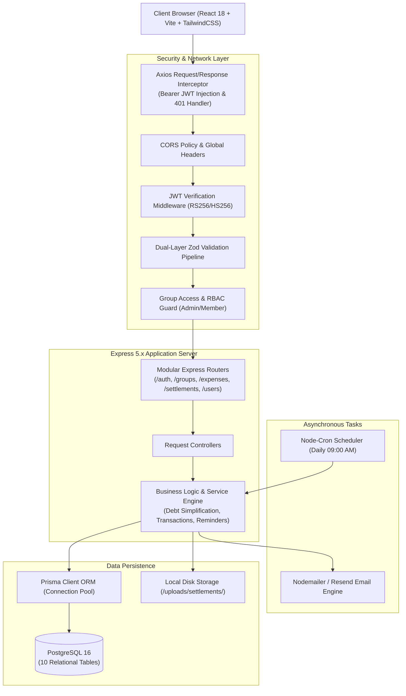

# SplitEase — System Architecture & Engineering Blueprint

## 1. Executive Summary
SplitEase is a full-stack, multi-tenant expense splitting and financial debt management platform. It allows groups (roommates, trips, teams) to track shared expenses with multi-payer flexibility, simplifies complex multi-party cross debts down to minimal transactions using algorithmic graph reduction, guarantees zero floating-point math error via integer-paisa accounting, and automates 7-day debt reminders via cron jobs and email notifications.

---

## 2. High-Level System Topology



---

## 3. Technology Stack Specification

| Component | Technology | Version / Details | Purpose |
| :--- | :--- | :--- | :--- |
| **Frontend Framework** | React | 18.x + TypeScript | Single Page Application UI |
| **Build Tool** | Vite | 8.x | High-speed HMR & production bundling |
| **Styling & Icons** | TailwindCSS + Lucide | Plus Jakarta Sans | Modern typography, fluid grids, responsive UI |
| **Animation** | Framer Motion | 11.x | Micro-interactions and animated modals |
| **HTTP Client** | Axios | Interceptors | Automatic Bearer auth injection & 401 redirection |
| **Backend Runtime** | Node.js | ES Modules (`"type": "module"`) | Scalable asynchronous event loop |
| **Web Framework** | Express | 5.x | RESTful API endpoints and middleware pipelines |
| **Database & ORM** | PostgreSQL + Prisma ORM | 5.x | Relational ACID transactions and schema migrations |
| **Authentication** | JWT + bcryptjs | Salt Factor 10 | Secure stateless session management |
| **Schema Validation** | Zod | 3.x | Strict runtime schema parsing and error formatting |
| **Background Jobs** | node-cron | 3.x | Automated 7-day unsettled debt reminder scans |
| **Email Delivery** | Nodemailer / Resend | Ethereal / Resend API | Automated reminder delivery |

---

## 4. Core Engineering Invariants

### 4.1. Zero Floating-Point Precision (Integer Paisa)
Financial calculations using IEEE 754 floating-point numbers inherently introduce rounding errors (e.g., `0.1 + 0.2 = 0.30000000000000004`). SplitEase strictly stores all monetary values in PostgreSQL as **Integers representing Paisa** ($1 \text{ PKR} = 100 \text{ Paisa}$). Decimal conversions occur exclusively at presentation boundaries.

### 4.2. Conservation of Net Balances
For any group of $N$ participants, the sum of all individual net balances $B_i$ strictly equals zero at all times:
$$\sum_{i=1}^N B_i = 0$$

### 4.3. Relational Transaction Isolation
All multi-table mutations (such as creating multi-payer expenses, cascading expense deletions, and group deletions) execute inside atomic `prisma.$transaction` blocks to prevent orphaned records or balance desynchronization.

---

## 5. Security & Request Pipeline

```
Incoming Request
   │
   ▼
1. CORS Middleware (Origin verification)
   │
   ▼
2. Static Asset / Uploads Serving (/uploads)
   │
   ▼
3. JWT Authentication Middleware (Extracts & verifies Bearer token -> req.user)
   │
   ▼
4. Group Access Control Middleware (Verifies membership & ADMIN role for target group)
   │
   ▼
5. Zod Validation Middleware (Validates request body against strict schemas; returns clean 400 on breach)
   │
   ▼
6. Controller Handler (Orchestrates service execution)
   │
   ▼
7. Service Layer (Executes business logic within Prisma transaction)
   │
   ▼
8. Global Error Handler (Translates unhandled exceptions to standardized JSON responses)
```

---

## 6. Directory Structure Overview

```
expense-splitting-platform/
├── AGENTS.md                   # Engineering guide & Agent operating manual
├── docs/                       # Official System Architecture & Engineering Docs
│   ├── ARCHITECTURE.md         # System Topology & Stack Specification
│   ├── ERD_DATA_MODELS.md      # Database ERD & Schema Reference
│   ├── DEBT_SIMPLIFICATION_ENGINE.md # Mathematical Foundations & Graph Algorithm
│   └── SEQUENCE_DIAGRAMS.md    # Core Workflow Sequence Diagrams
├── backend/
│   ├── prisma/schema.prisma    # PostgreSQL Schema
│   └── src/
│       ├── config/             # DB Client, Swagger OpenAPI, Cron Schedules
│       ├── controllers/        # Express Request Handlers
│       ├── middleware/         # Auth, GroupAccess, Zod Validation, Multer, Error Handlers
│       ├── routes/             # REST Route Declarations
│       ├── services/           # Balance, Expense, Settlement, Reminder, Email Services
│       └── utils/              # Paisa/Rupee Converters, Tokens, Invite Code Generators
└── frontend/
    └── src/
        ├── api/                # Type-safe Axios Client & API Endpoints
        ├── components/         # Reusable UI Components (Modals, Lists, Popovers)
        ├── context/            # AuthContext (JWT Authentication & Session State)
        ├── pages/              # Dashboard, GroupsList, GroupDetails, Activity, Settings, Login
        └── types/              # TypeScript Interfaces
```
