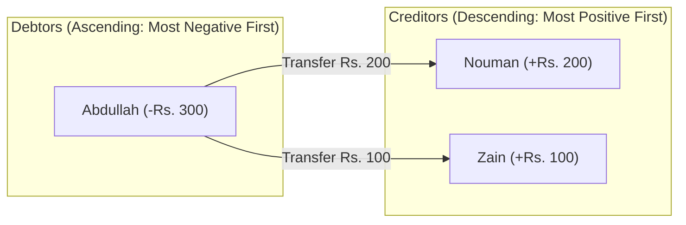

# SplitEase — Algorithmic Debt Simplification Engine

## 1. Problem Definition: The $N(N-1)$ Debt Explosion
In groups sharing multiple joint expenses (e.g. roommates or vacation trips), individuals frequently pay on behalf of different subsets of members. 

Without algorithmic optimization, calculating pairwise debts leads to a dense, circular graph with up to $\frac{N(N-1)}{2}$ chaotic transactions:

```
[Ahsan] ──(Rs. 500)──► [Nouman]
[Nouman] ──(Rs. 300)──► [Zain]
[Abdullah] ──(Rs. 400)──► [Ahsan]
[Zain] ──(Rs. 200)──► [Abdullah]
(Total: 6 redundant cross-payments)
```

---

## 2. Mathematical Foundations

### 2.1. Conservation of Net Balances Invariant
For any group $G$ of $N$ members, each user $i$'s net financial position $B_i$ is defined as:

$$B_i = \sum \text{Paid}_i - \sum \text{Share}_i + \sum \text{SettledOut}_i - \sum \text{SettledIn}_i$$

- **$B_i > 0$ (Creditor)**: The user is owed money by the group.
- **$B_i < 0$ (Debtor)**: The user owes money to the group.
- **$B_i = 0$ (Settled)**: The user has zero net financial obligation.

#### The Zero-Sum Invariant:
$$\sum_{i=1}^N B_i = 0$$

All positive balances (credits) strictly equal the sum of all negative balances (debts).

---

## 3. Greedy Graph Simplification Algorithm

SplitEase transforms the debt graph into a bipartite matching problem and greedily cancels obligations down to at most **$N-1$ linear transfers**.



### 3.1. Algorithmic Steps
1. **Compute Net Balances**: Iterate over all group expenses and confirmed settlements to calculate $B_i$ for each member in integer Paisa.
2. **Partition & Sort**:
   - Separate members with $B_i < -100$ into `debtors` list, sorted ascending (most negative first).
   - Separate members with $B_j > 100$ into `creditors` list, sorted descending (most positive first).
3. **Two-Pointer Greedy Matching**:
   - While `debtors` and `creditors` are non-empty:
     $$\text{amount} = \min(|B_{\text{debtor}}|, B_{\text{creditor}})$$
   - Create a simplified transfer: $\text{debtor} \xrightarrow{\text{amount}} \text{creditor}$.
   - Deduct $\text{amount}$ from both balances:
     $$B_{\text{debtor}} \leftarrow B_{\text{debtor}} + \text{amount}$$
     $$B_{\text{creditor}} \leftarrow B_{\text{creditor}} - \text{amount}$$
   - If $B_{\text{debtor}} = 0$, advance the debtor pointer.
   - If $B_{\text{creditor}} = 0$, advance the creditor pointer.

### 3.2. Complexity Analysis
- **Time Complexity**: $O(N \log N)$ (due to sorting of debtors and creditors). Matching is linear $O(N)$.
- **Space Complexity**: $O(N)$ auxiliary memory for net balance tracking.
- **Transaction Bound**: Maximum transfers produced is strictly bounded by $N - 1$.

---

## 4. Practical Simplification Walkthrough

### Initial State (4 Members):
- **Ahsan**: Paid Rs. 500, owes Rs. 500 $\implies B = 0$
- **Nouman**: Paid Rs. 300, owes Rs. 100 $\implies B = +200$
- **Abdullah**: Paid Rs. 0, owes Rs. 300 $\implies B = -300$
- **Zain**: Paid Rs. 200, owes Rs. 100 $\implies B = +100$

### Simplified Execution:
1. **Debtors**: `[Abdullah: -300]`
2. **Creditors**: `[Nouman: +200, Zain: +100]`
3. **Transfer 1**: Abdullah pays Nouman **Rs. 200**. (Nouman settled, Abdullah has -100 remaining).
4. **Transfer 2**: Abdullah pays Zain **Rs. 100**. (Zain settled, Abdullah settled).

**Result**: 6 confusing cross-debts reduced to **2 crystal-clear transfers** (67% reduction).

---

## 5. Smart Round-Up & Overpayment Reconciliation

When users settle debts via Pakistani mobile banking apps (EasyPaisa, JazzCash, Sadapay, Nayapay, Raast), sending odd fractional amounts (e.g. `Rs. 1,454.55`) is inconvenient. 

SplitEase provides **1-Click Smart Round-Up UX**:
- **Nearest 10**: `Rs. 1,454.55` $\to$ `Rs. 1,460.00` (Overpay +Rs. 5.45)
- **Nearest 50**: `Rs. 1,454.55` $\to$ `Rs. 1,500.00` (Overpay +Rs. 45.45)
- **Nearest 100**: `Rs. 1,454.55` $\to$ `Rs. 1,500.00`

### Automatic Balance Reconciliation
Because net balances are derived strictly from graph conservation, overpaying a debt does **not** corrupt group balances:
- The payer's net balance increases by the exact overpaid amount, automatically turning them into a future group creditor.
- The payee's net balance decreases proportionally, seamlessly reducing their future receivables.
