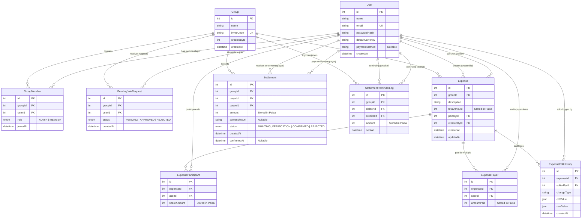

# SplitEase — Database ERD & Schema Reference

## 1. Entity Relationship Diagram (Mermaid)

---

## 2. Table Specifications & Constraints

### 2.1. `User`
Stores registered member credentials, profile settings, and payment receiving methods.
- **`id`** (`Int`, PK, Autoincrement): Unique user identifier.
- **`name`** (`String`, max 35 chars): Full display name.
- **`email`** (`String`, Unique): Lowercase verified email.
- **`passwordHash`** (`String`): Bcrypt salted hash (cost factor 10).
- **`defaultCurrency`** (`String`, Default: `"Rs."`): Preferred display symbol.
- **`paymentMethod`** (`String`, Nullable): Verified receiving account string (e.g. `"EasyPaisa: 03001234567 (Hamza Tariq)"`).

---

### 2.2. `Group` & `GroupMember`
Manages group multi-tenancy and Role-Based Access Control (RBAC).
- **Composite Unique Constraint**: `@@unique([groupId, userId])` on `GroupMember` prevents duplicate memberships.
- **Roles**:
  - `ADMIN`: Can invite members, approve/reject join requests, remove zero-balance members, and permanently delete the group.
  - `MEMBER`: Can add expenses, record settlements, and view activity.

---

### 2.3. `Expense`, `ExpensePayer`, & `ExpenseParticipant`
Implements normalized, multi-payer, and unequally-split expense modeling.
- **`totalAmount`**, **`amountPaid`**, **`shareAmount`**: Stored as **Integers in Paisa** ($1 \text{ PKR} = 100 \text{ Paisa}$).
- **Single-Payer**: `Expense.paidById` references primary payer.
- **Multi-Payer**: `ExpensePayer` table stores each contributor's share.
- **Participants**: `ExpenseParticipant` stores each member's exact calculated share in paisa.
- **Composite Unique Constraints**:
  - `ExpensePayer`: `@@unique([expenseId, userId])`
  - `ExpenseParticipant`: `@@unique([expenseId, userId])`

---

### 2.4. `ExpenseEditHistory` (Immutable Audit Trail)
Maintains audit integrity for legal and dispute resolution.
- **`changeType`**: Description of change (`"AMOUNT_CHANGED"`, `"PARTICIPANTS_MODIFIED"`, etc.).
- **`oldValue` / `newValue`** (`Json`): Complete snapshots before and after the edit.

---

### 2.5. `Settlement`
Tracks direct peer-to-peer repayments with proof screenshots.
- **`status`**: Defaults to `AWAITING_VERIFICATION`. Only transitions to `CONFIRMED` upon explicit confirmation by `payeeId`.
- **`screenshotUrl`**: Stored path to the uploaded payment proof (`/uploads/settlements/...`).

---

### 2.6. `SettlementReminderLog`
Tracks 7-day automated and manual debt reminder cooldowns.
- **`sentAt`**: Timestamp of notification. The cron engine queries `sentAt >= NOW() - INTERVAL '7 DAYS'` to prevent debtor spamming.
