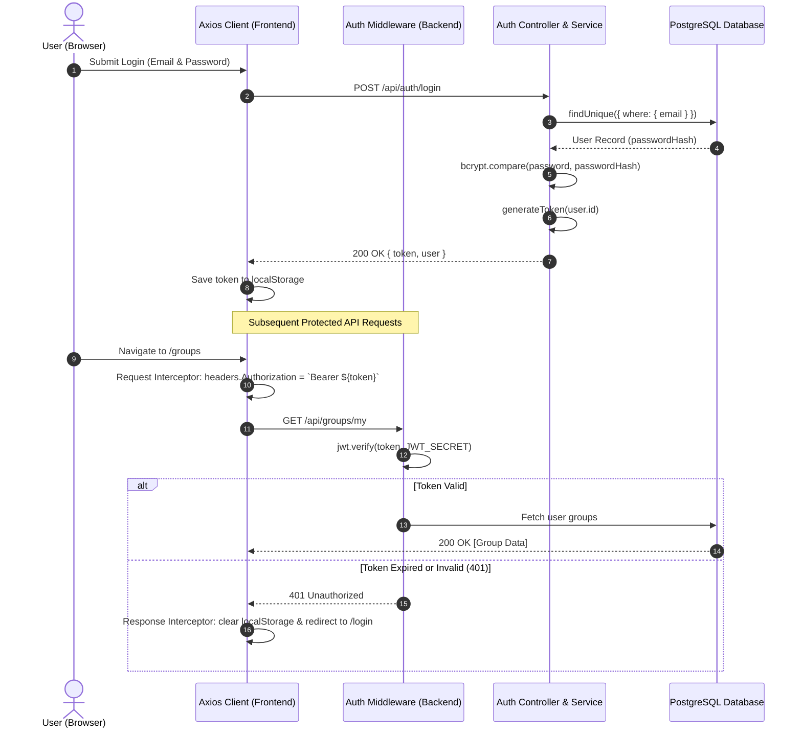
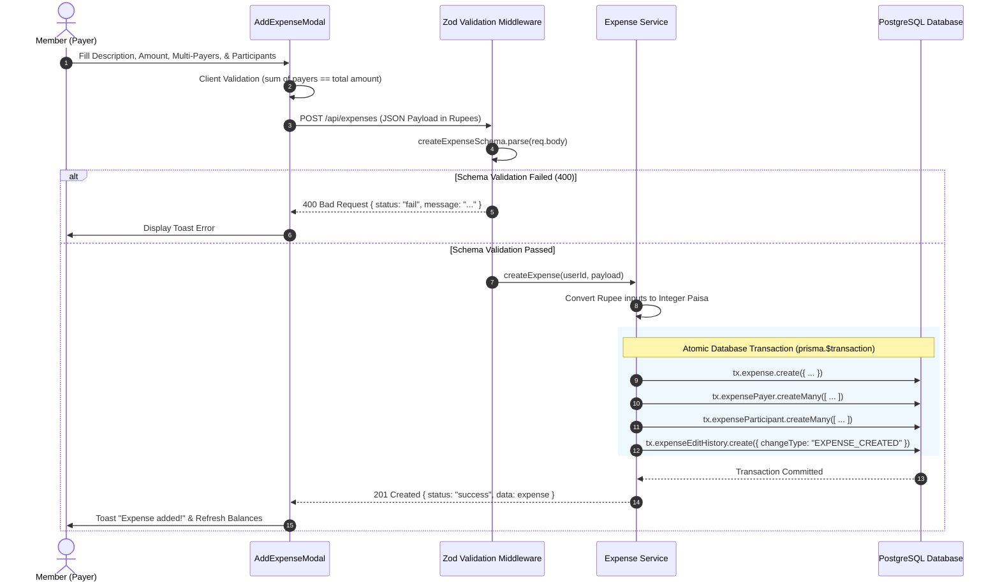
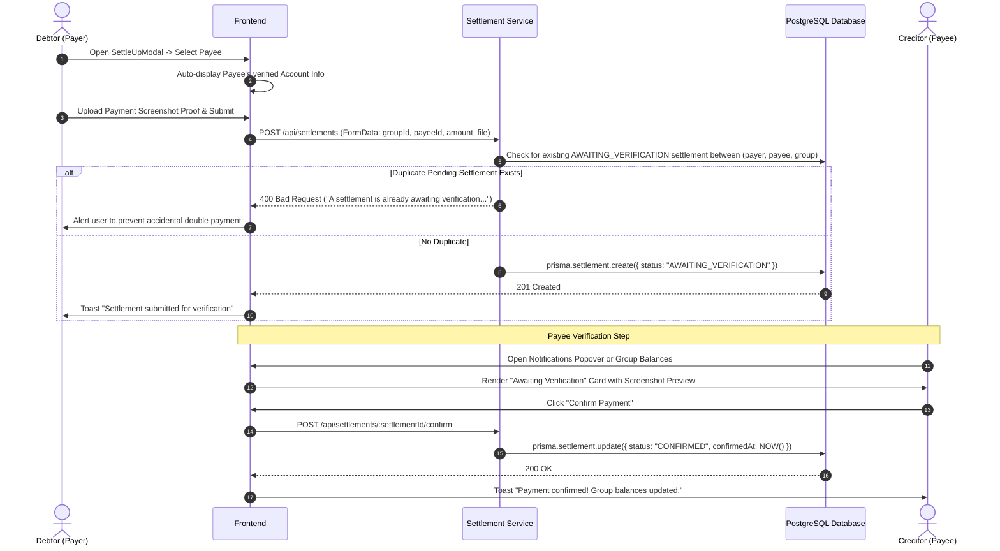
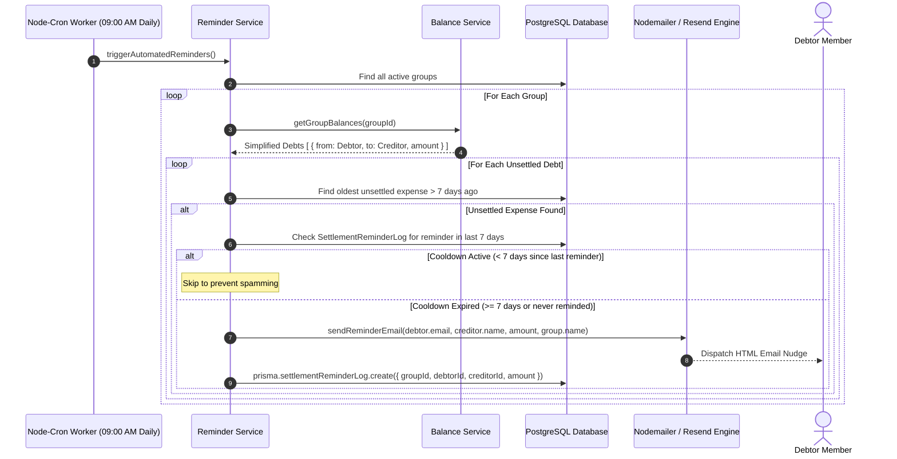

# SplitEase — Core Workflow Sequence Diagrams

## 1. Authentication & Bearer Interceptor Lifecycle

---

## 2. Multi-Payer Expense Creation & Relational Transaction

---

## 3. Structured Settlement & Payee Confirmation Cycle

---

## 4. Automated 7-Day Background Debt Reminder Workflow

